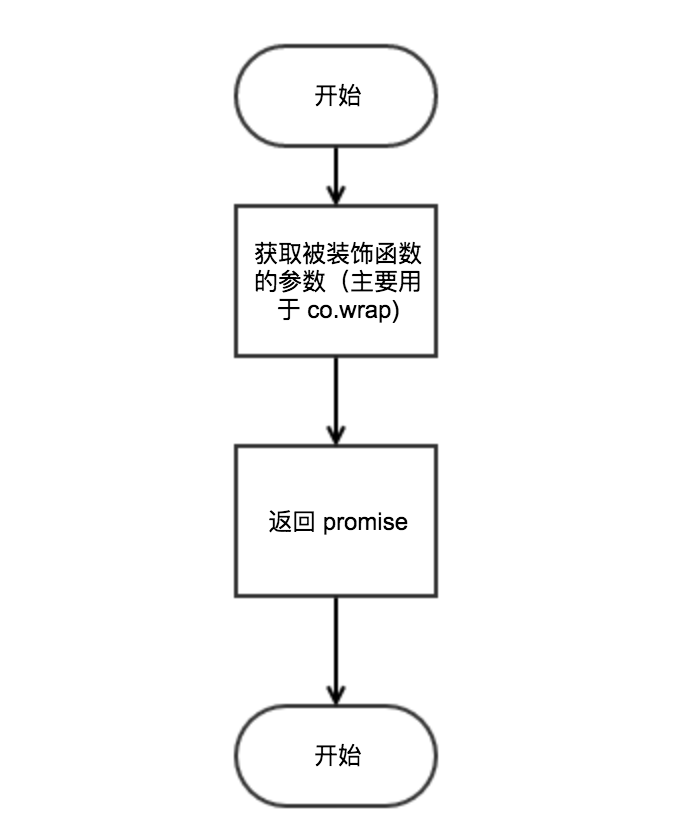
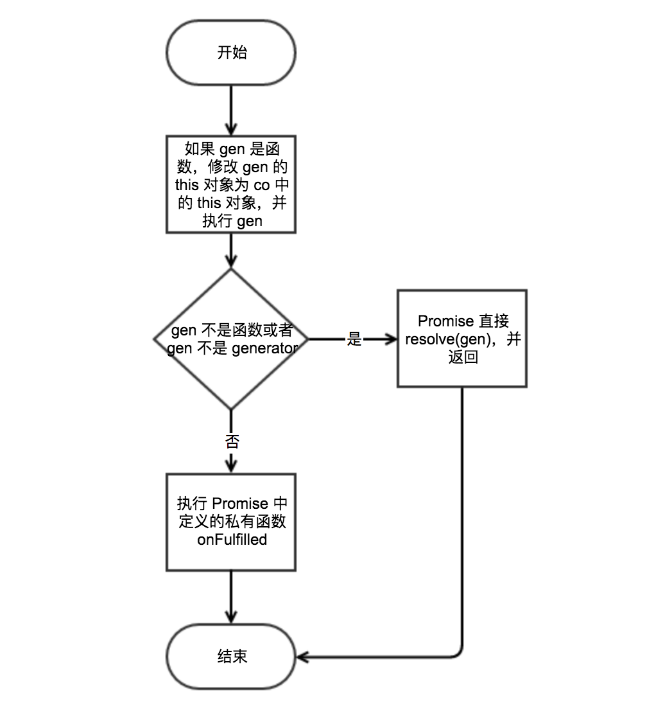
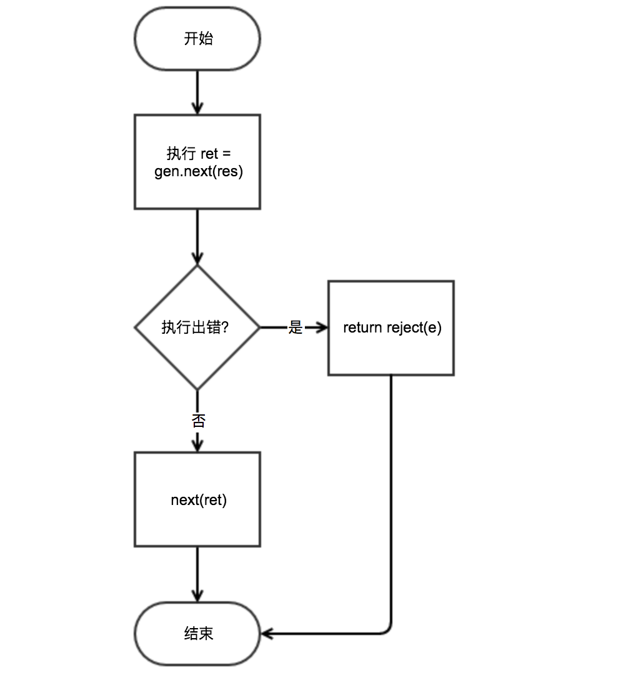
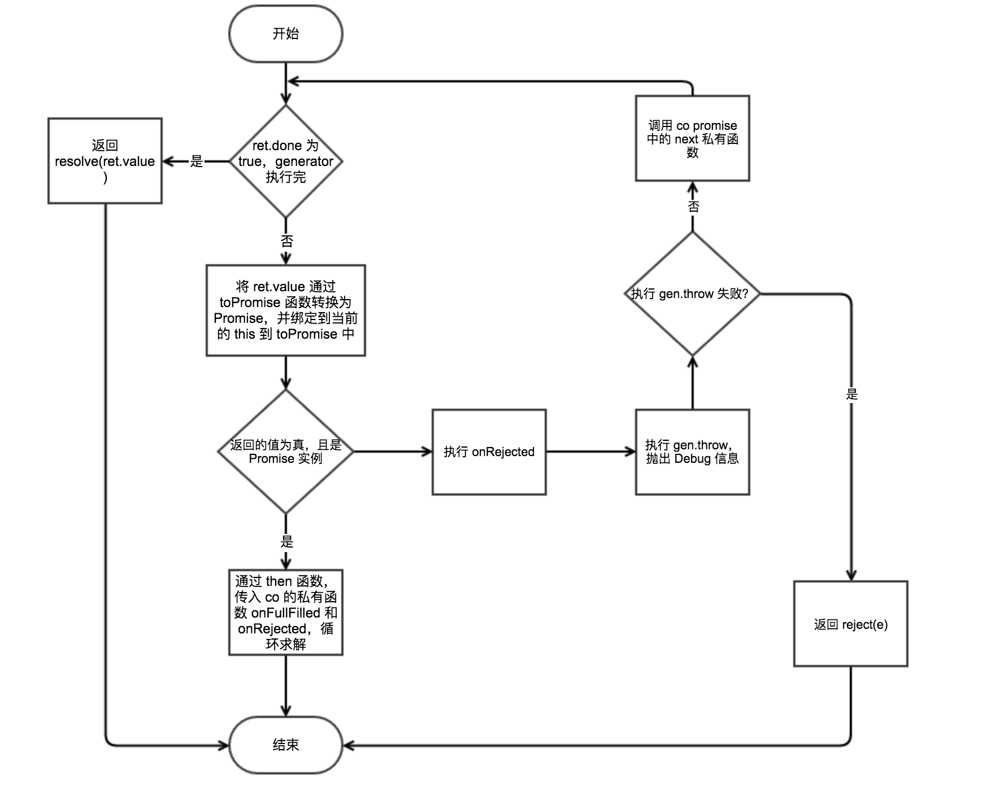

title: Co 源码解读
date: 2017-02-17 17:43:27
tags: [JavaScript, NodeJs]
---

[co](https://github.com/tj/co) 是 [koa](https://github.com/koajs/koa) 中使用到的基础库，用于 [Generator](https://developer.mozilla.org/en/docs/Web/JavaScript/Reference/Statements/function*)
委派执行，并且可以让开发者更方便编写非阻塞的代码。

<!-- more -->

以下是使用 `co` 执行的一个例子:

```js
const co = require('co')

co(function *() {
  let rst = yield Promise.resolve(1)
  return rst
}).then((value) => {
  console.log(value)
})
```

### 函数在 `co` 中执行的整体流程图如下



核心部分就是 `co` 中，返回 `Promise` 实例中，其整体执行的流程如下：



1. 判断传入 `co` 中的 `gen` 是否为函数，如果是函数，则绑定当前的上下文到 `gen` 中，并传入 `gen` 所需要的参数，代码如下：

```js
if (typeof gen === 'function') gen = gen.apply(ctx, args);
```

2. 如果 `gen` 不是合法的值，或者 `gen` 不是 `Generator function`，`Promise` 直接 `return resolve(gen)`，否则进入 `3`，代码如下：

```js
if (!gen || typeof gen.next !== 'function') return resolve(gen);
``` 

3. 执行在 `Promise` 中定义的私有函数 `onFulfilled`.

### `co` 中核心部分的 `onFulfilled` 的执行流程



1. 首先执行 `gen.next(res)` (`res` 在第一次执行时为 `undefined`)，如果执行出错，转入 `2`，如果成功执行，转入 `3`；
2. 直接执行 `reject(e)`，并直接返回;
3. 执行 `next(ret)`，转入 `4`；
4. 结束 `onFulfilled` 执行。

### `onFulfilled` 中核心部分是 `next(ret)`，其执行流程如下



1. 如果在 `co` 中执行的是 `Generator`， 并且其已经执行完 `res.done` 为 `true`，直接将 `resolve(res.value)`，否则进入 `2`；
2. 通过调用函数 `toPromise`，将 `res.value` 转换为 `Promise`，然后进入 `3`；
3. 如果 `toPromise` 返回的是 `Promise`，则通过 `then` 方法求解 `return value.then(onFulfilled, onRejected)`，否则 `4`；
4. `toPromise` 的返回值是不支持类型，调用 `onRejected` 打印出 `debug` 信息，并继续调用 `next` 求解，返回 `1`执行。


在 `toPromise` 支持了下面几种类型，转换到 `Promise`:

- Generator function
- Normal function
- JavaScript object
- JavaScript array

以上便是 `co` 的整个执行流程，通过把 `Generator function` 放入 `Promise` 中执行，进一步简化了 JavaScript 的异步代码的编写。